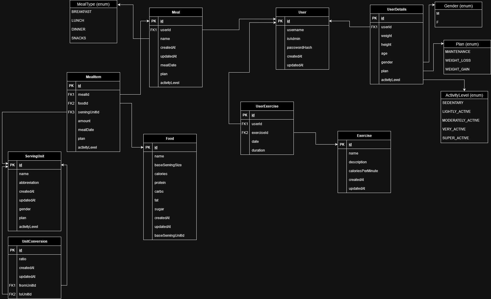

# FoodTracker

**FoodTracker** is a REST API that provide users with the functionalities to keep track of their daily meals and exercise. Once registered and logged in, a user can add their details, in order to get their daily ideal nutritional values . After doing so, the user can create meals and add food to them. They can also add exercise in the app, so that they keep record of the burnt calories in a day as well.

## Setup

In order to run the application, first clone this repository.

After cloning the repo, one has to open a terminal and run the `npm run db` script in order to run the database in a docker container (be sure to first start the docker daemon, either from terminal on _Linux_ or by running the **Docker Desktop** app on _Windows_).

Once the database is running, simply run the command `npm run start` to run the application.

## Environment Variables

`DATABASE_URL` = the URL for database connection

`POSTGRES_USER` = the user for database connection

`POSTGRES_PASSWORD` = the password for database connection

`POSTGRES_DB` = the name of the database

`POSTGRES_HOST` = the host where the database is running

`POSTGRES_PORT_DOCKER` = the port that the database is listening in Docker

`POSTGRES_PORT` = the port on the host machine where the database can be accessed

`JWT_SECRET` = the secret key for JWT

`SERVER_PORT` = the port where the API is running on the host machine

## Database Diagram

## Demo Usage Flow

A user can access a few functionalities, such as searching for food and exercises, even **without** registering and logging in.

For access to the entire set of functionalities one must register into the application first, and then log in. After that, they can add details about themselves (_weight_, _height_, _age_, _gender_, _activity level_ and _weight plan_). Moreover, a user can get, only after adding **all** user details, their calculated BMR, TDEE and ideal nutritional values (_calories_, _protein_, _fat_, _carbs_, _sugar_) for them.They can also create meals (_breakfast_, _lunch_, _dinner_, _snacks_) for a particular date and add food items for those meals with specified quantity and serving unit. Exercises can be logged for any day with a specified duration. If they have previously added details about themselves and they have logged meals and even exercises for a particular day, they can get the consumed and remaining nutritional values for that specific day (e.g. if the ideal number of calories is 2000, they consumed a total of 1000 for the meals in that day and burned 700 calories during exercise in that day, the remaining number of calories is 2000 - 1000 + 700 = 1700).

The application integrates functionalities for admins as well. After loggin in, an admin can _create_ / _update_ / _delete_ **food**, **exercises**, **units** and **unit conversion rates**.
